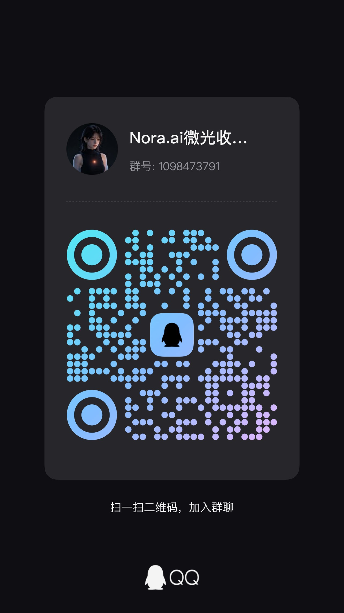
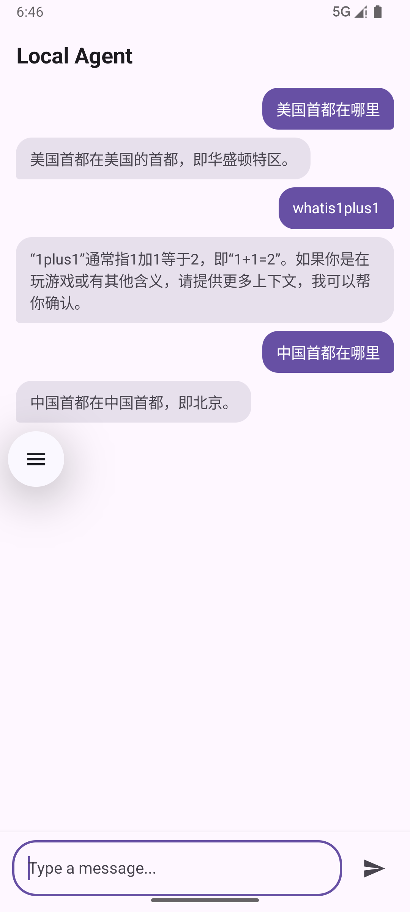

# Nora — 本地离线 AI 智能体

> 隐私优先，数据永不离开设备。运行于 Android，基于 Qwen3-0.6B 本地推理，零网络请求。

[](https://developer.android.com/about/versions/15)
[](LICENSE)
[](https://huggingface.co/Qwen)

## 核心特性

| 特性 | 描述 |
|------|------|
| **离线运行** | 完全本地推理，无需网络连接 |
| **隐私优先** | 数据存储在设备本地，无云端同步 |
| **通知聚合** | 自动读取并整理设备通知（需授权） |
| **文件上下文** | 支持加载本地文件作为对话上下文 |
| **LLM 摘要** | 基于 Qwen3-0.6B 自动生成摘要 |

## 加入群聊

扫码加入 Nora 用户交流群，获取更新通知和使用支持：



## 截图预览



## 下载 APK

我们提供两个预构建版本：

| 版本 | 文件 | 大小 | 说明 |
|------|------|------|------|
| **厚集成** | [nora-bundled-release.apk](./nora-bundled-release.apk) | ~34 MB | 内置模型，启动即用（需先配置模型文件） |
| **薄集成** | [nora-slim-release.apk](./nora-slim-release.apk) | ~34 MB | 无内置模型，体积更小 |

> 📦 两个 APK 当前均不含模型文件。厚集成版本在添加 `assets/models/model.pte` 后可实现一键安装。

### 前置要求

- Android 设备（API 36+）或模拟器
- 已安装 Android SDK 和 Gradle（仅构建时需要）

### 1. 下载模型文件

Nora 需要 Qwen3-0.6B 量化模型才能运行 LLM 对话功能。

**方式 A：手动下载**

访问 [Qwen3 GGUF 模型下载页面](https://huggingface.co/Qwen/Qwen3-0.6B-GGUF)，下载量化版本（如 `qwen3-0.6b-q4_k_m.gguf`），重命名为 `model.pte` 并放置到：

```
/data/local/tmp/llama/model.pte
```

**方式 B：让 AI 助手帮你下载**

你可以将以下提示复制给 AI 助手（如 Claude、WorkBuddy 等）：

```
请帮我下载 Qwen3-0.6B 量化模型：
1. 访问 https://huggingface.co/Qwen/Qwen3-0.6B-GGUF
2. 下载 q4_k_m 量化版本（推荐）
3. 使用 ADB 将文件推送到模拟器/设备：
   adb push qwen3-0.6b-q4_k_m.gguf /data/local/tmp/llama/model.pte
4. 如果目录不存在，先创建：
   adb shell mkdir -p /data/local/tmp/llama
```

### 2. 构建项目

```bash
# 克隆仓库
git clone https://github.com/HarnessTeam/Nora.git
cd Nora

# 构建 Debug APK
./gradlew assembleDebug

# 安装到设备
adb install app/build/outputs/apk/debug/Nora-debug.apk
```

### 3. 配置权限

首次启动后，Nora 会引导你配置以下权限：

| 权限 | 用途 |
|------|------|
| 通知监听 | 读取设备通知并生成摘要 |
| 存储访问 | SAF 文件选择器，按需授权 |
| 后台运行 | WorkManager 定期处理 |

## 项目结构

```
Nora/
├── app/
│   ├── src/main/
│   │   ├── java/ai/nora/
│   │   │   ├── data/          # Room 数据库层
│   │   │   ├── llm/           # ExecuTorch 推理引擎
│   │   │   ├── model/         # 数据模型
│   │   │   ├── ui/            # Compose UI
│   │   │   ├── theme/         # 暗色主题
│   │   │   ├── NoraApp.kt     # Application 入口
│   │   │   └── Navigation.kt  # 导航
│   │   └── AndroidManifest.xml
│   └── build.gradle.kts
├── gradle/                     # Gradle Wrapper
├── build.gradle.kts
└── settings.gradle.kts
```

## 开发指南

### 环境要求

- JDK 17+
- Android SDK API 36
- Gradle 8.x

### 构建命令

```bash
# Debug 构建（默认厚集成）
./gradlew assembleDebug

# Release 构建
./gradlew assembleRelease

# 按变体构建
./gradlew assembleBundledDebug    # 厚集成 Debug
./gradlew assembleSlimDebug        # 薄集成 Debug
./gradlew assembleBundledRelease   # 厚集成 Release
./gradlew assembleSlimRelease      # 薄集成 Release

# 运行测试
./gradlew testDebugUnitTest
./gradlew connectedDebugAndroidTest

# 安装到设备
adb install -r app/build/outputs/apk/bundled/debug/app-bundled-debug.apk
adb install -r app/build/outputs/apk/slim/debug/app-slim-debug.apk
```

### 添加模型文件到源码（可选）

如果你希望模型随 APK 一起打包：

1. 将模型文件放置到 `app/src/main/assets/model/model.pte`
2. 修改代码中的模型加载路径
3. 重新编译

> ⚠️ 警告：量化模型约 400-500MB，打包后 APK 会很大。建议使用外部加载方式。

## 技术栈

| 层级 | 技术 |
|------|------|
| UI | Jetpack Compose + Material3 |
| 架构 | MVVM + Clean Architecture |
| 数据库 | Room (SQLite) |
| 导航 | Navigation Compose |
| LLM | ExecuTorch + Qwen3-0.6B |
| 后台任务 | WorkManager |
| 通知 | NotificationListenerService |

## 宪法约束

Nora 开发遵循以下核心原则：

- **零网络** — 严禁引入 INTERNET 权限
- **隐私优先** — 所有数据本地存储
- **权限克制** — 权限必须用户主动授权
- **离线优先** — 所有功能必须能在无网络环境运行

## 许可证

[MIT License](LICENSE)

---

## Star History

[](https://star-history.com/#HarnessTeam/Nora&type=date)
